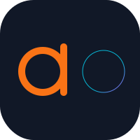

<p align="center">
  <a href="assets/brand/Soul.md">
    
  </a>
</p>

<h1 align="center">Aobus</h1>

<p align="center">
  <strong>A high-performance, Bit-Perfect audio engine and music library built with C++23.</strong>
</p>

<p align="center">
  
  
  
</p>

---

Aobus (pronounced /'eɪ.oʊ.bʌs/) is a modern music application designed for audiophiles who demand uncompromising sound quality and architectural elegance. Combining the robustness of **LMDB** storage with the power of **C++23**, Aobus bridges the gap between low-level audio engineering and high-level library management.

## 🌟 Key Features

- **Bit-Perfect Pipeline**: Ensuring every sample reaches your hardware exactly as intended.
- **Ultra-Fast Library Indexing**: Powered by LMDB for instantaneous search and filtering.
- **Reactive Architecture**: Modern C++ patterns for low-latency UI and audio synchronization.
- **Industrial Minimalist Design**: A UI that respects your music and your desktop.

## 🛠 Building

Aobus uses CMake and Nix-shell for dependency management.

```bash
# Debug build (with sanitizers)
./build.sh debug

# Clean rebuild
./build.sh debug --clean

# Release build for production
./build.sh release
```

## 🧪 Running Tests

Aobus takes stability seriously. We maintain a comprehensive suite of unit and integration tests.

```bash
# Run core test suite
/tmp/build/debug/test/ao_test

# Run Linux-specific tests
/tmp/build/debug/test/ao_test_gtk
```

## 🤖 AI Agents

If you are an AI agent working on this project, please read [AGENTS.md](AGENTS.md) for critical environment setup and coding standards.

## 📄 License

The Aobus source code is licensed under the **MIT License**. See [LICENSE](LICENSE) for details.

**Brand Assets Exception:**
The Aobus logo and its associated design documentation located in the `assets/brand/` directory are the personal intellectual property of YANG LI and are **NOT** covered by the MIT License. All rights are reserved. Usage of these brand assets in derivative works or third-party products requires explicit written permission.

---

<p align="center">
  <i>"Where audio structure meets artistic resonance."</i>
</p>
