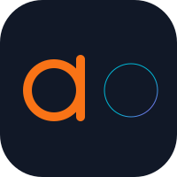

<p align="center">
  <a href="asset/brand/Soul.md">
    
  </a>
</p>

<h1 align="center">Aobus</h1>

<p align="center">
  <strong>A high-performance, Bit-Perfect audio engine and music library built with C++26.</strong>
</p>

<p align="center">
  
  
  
</p>

---

Aobus (pronounced /'eɪ.oʊ.bʌs/) is a modern music application designed for audiophiles who demand uncompromising sound quality and architectural elegance. Combining the robustness of **LMDB** storage with the power of **C++26**, Aobus bridges the gap between low-level audio engineering and high-level library management.

## 🌟 Key Features

- **Bit-Perfect Pipeline**: Ensuring every sample reaches your hardware exactly as intended.
- **Ultra-Fast Library Indexing**: Powered by LMDB for instantaneous search and filtering.
- **Reactive Architecture**: Modern C++ patterns for low-latency UI and audio synchronization.
- **Industrial Minimalist Design**: A UI that respects your music and your desktop.

## 🛠 Building

Aobus uses CMake with pinned Nix dependencies on Linux and vcpkg on Windows.

### Linux

```bash
# Debug build + full test suites (the standard validation gate)
./ao check

# Incremental debug build only
./ao build

# Clean rebuild
./ao build debug --clean

# Release build for production
./ao build release
```

The portal re-enters the pinned `nix-shell` automatically. Linux build trees
default to `/tmp/build/<project-directory>` (for example, `/tmp/build/Aobus`),
using only the source directory's final name. Set `AOBUS_BUILD_ROOT` to replace
the `/tmp/build` base while retaining that project-directory component.
Portal commands that mutate one build tree serialize through a persistent
exclusive lock beside that tree and report when they wait for another writer.
The adjacent `.ao-build.lock` file survives `--clean`; it does not reserve a
stable read snapshot for running applications, tests, or analysis tools.
Governed dependency versions and native resolver identities can be inspected
with `./ao deps report`. Follow the [dependency upgrade workflow](doc/development/dependency-upgrade.md)
when changing Nixpkgs, vcpkg, C++ dependency, Python, Ruff, or mypy pins.

### Windows

Install Visual Studio Build Tools with the C++ x64 toolset, then use the Windows
portal from a Command Prompt or PowerShell terminal. The portal provisions its
pinned Python environment on first use:

```bat
ao.bat build
ao.bat run tui
ao.bat test
ao.bat check
```

`ao.bat` initializes the Visual Studio environment and uses the vcpkg bundled
with Visual Studio. See [Windows development](doc/development/windows.md)
for prerequisites, build trees, and suite availability.

## 🧪 Running Tests

Aobus takes stability seriously. We maintain a comprehensive suite of unit and integration tests. All suites run through the development portal:

```bash
# Run the default fast loop (core + GTK on Linux)
./ao test

# Run every registered suite
./ao test --all

# Run tests for the development tooling
./ao test --tooling

# Full validation gate: build everything + all test suites
./ao check
```

The portal resolves the correct build tree, including when
`AOBUS_BUILD_ROOT` relocates it. Invoking Catch2 binaries directly from the
build tree is a debugging technique, not the supported workflow.

## 🤖 AI Agents

If you are an AI agent working on this project, please read [AGENTS.md](AGENTS.md) for critical environment setup and coding standards.

## 📄 License

The Aobus source code is licensed under the **MIT License**. See [LICENSE](LICENSE) for details.

**Brand Assets Exception:**
The Aobus logo and its associated design documentation under `asset/brand/` are the personal intellectual property of YANG LI and are **NOT** covered by the MIT License.
Their [brand asset license](asset/brand/LICENSE.txt) permits unmodified bundled distribution with Aobus while reserving modification, standalone reuse, and other brand rights.

---

<p align="center">
  <i>"Where audio structure meets artistic resonance."</i>
</p>
