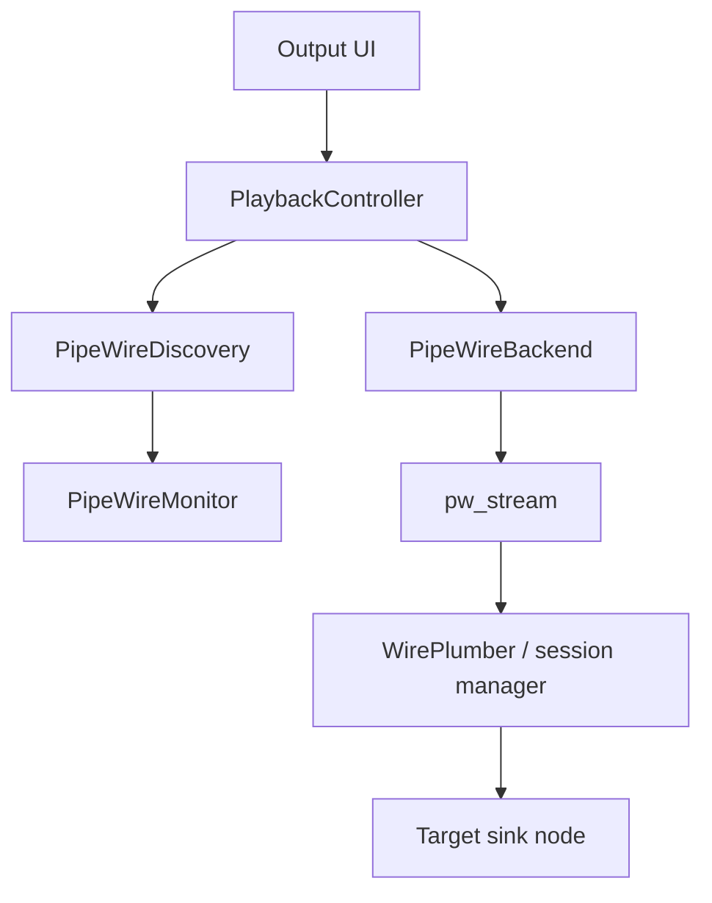

# PipeWire Playback And Exclusive Mode

Date: 2026-04-27

## Goal

Document how PipeWire playback works in Aobus, how PipeWire exclusive mode is requested through the stream API, and which pitfalls have already caused regressions in this codebase.

This note is about the current Linux playback backend in:

- `app/platform/linux/playback/PipeWireBackend.h`
- `app/platform/linux/playback/PipeWireBackend.cpp`
- `app/core/playback/PlaybackController.cpp`
- `app/core/playback/PlaybackEngine.cpp`

It focuses on `pw_stream` output playback streams, not on implementing a custom PipeWire sink/source node.

## PipeWire Model In One Page

PipeWire playback involves a few distinct concepts:

- `pw_thread_loop`: a dedicated event loop thread used to interact with PipeWire safely.
- `pw_context`: the client context created on top of the loop.
- `pw_core`: the connection to the PipeWire server.
- `pw_registry`: the global object catalog used for discovering nodes and links.
- `pw_stream`: the client playback stream used to push PCM into the PipeWire graph.
- PipeWire node: a graph object representing a sink, source, adapter, stream node, filter, or device-facing endpoint.
- PipeWire link: an edge between nodes in the graph.
- Session manager: usually WirePlumber, which decides how streams get linked into the graph.

For normal application playback, the app creates a `pw_stream`, advertises the audio formats it can produce, and lets PipeWire plus the session manager connect that stream to a sink.

## Shared Playback vs Exclusive Playback

Aobus exposes two PipeWire modes:

- Shared mode: a normal playback stream that joins the regular graph and can be mixed with other clients.
- Exclusive mode: a playback stream that targets a specific sink node and requests exclusive access to the resources behind that target.

Exclusive mode is still PipeWire playback. It is not the same thing as bypassing PipeWire and talking to ALSA directly. The backend still uses `pw_stream`; it just uses different target and stream properties.

## Aobus Architecture

The current backend is split into two jobs.

### 1. Discovery and graph inspection

`PipeWireDiscovery` and `PipeWireMonitor` maintain a registry view of the live PipeWire graph.

Responsibilities:

- enumerate sink nodes
- collect sink metadata such as `node.name`, `node.nick`, `object.path`, and `object.serial`
- observe active links
- observe the negotiated stream format and sink format
- build the audio graph shown in the UI

Important implementation detail:

- Aobus currently uses `object.serial` as the runtime device ID exposed to the playback controller for PipeWire devices.

### 2. Playback

`PipeWireBackend` owns the actual playback stream.

Responsibilities:

- create a dedicated PipeWire loop/context/core
- create a `pw_stream`
- set stream properties such as `target.object` and `node.exclusive`
- connect the stream with `pw_stream_connect()`
- push PCM in the `process` callback

## Current Aobus Flow

Runtime sequence:

1. `PlaybackController` asks discovery providers for available devices.
2. `PipeWireMonitor` enumerates sink nodes from the registry.
3. Aobus builds `AudioDevice` entries from those nodes.
4. When the user selects a PipeWire output, the controller creates a `PipeWireBackend` with the chosen device ID.
5. `PipeWireBackend::open()` creates a `pw_stream`, sets stream properties, builds a format pod, and calls `pw_stream_connect()`.
6. Once PipeWire schedules the stream, the `process` callback dequeues a buffer, copies PCM into it, and requeues the buffer.

## The Relevant PipeWire Stream API

For playback, Aobus uses a `PW_DIRECTION_OUTPUT` stream.

High-level sequence:

1. `pw_init()` once per process.
2. Create `pw_thread_loop`.
3. Create `pw_context` on that loop.
4. Connect `pw_context` to get `pw_core`.
5. Create a `pw_stream`.
6. Add a stream listener.
7. Build one or more SPA format pods.
8. Call `pw_stream_connect()`.
9. Activate the stream with `pw_stream_set_active(stream, true)`.
10. In `process`, dequeue, fill, and queue buffers.

The most important callbacks for this backend are:

- `process`: PipeWire is asking for more audio.
- `param_changed`: PipeWire reports the negotiated stream format.
- `state_changed`: PipeWire reports state transitions and errors.
- `drained`: playback completed and the stream finished draining.

## How Shared Mode Works

In shared mode, Aobus:

- creates a playback stream
- sets the usual media properties (`media.type`, `media.category`, app name, node name)
- advertises a raw audio format with `SPA_PARAM_EnumFormat`
- connects with `PW_STREAM_FLAG_AUTOCONNECT | PW_STREAM_FLAG_MAP_BUFFERS`

Key property behavior:

- if `target.object` is empty, PipeWire and the session manager route to the default sink
- format negotiation is flexible
- PipeWire may insert adapters/converters
- other clients may share the same sink

This is the normal desktop-audio path.

## How Exclusive Mode Works

In Aobus, exclusive mode adds three important constraints.

### 1. It must target a specific sink

Exclusive mode only makes sense when the stream targets a concrete sink node. Aobus therefore stores the selected PipeWire device identity and sets:

- `PW_KEY_TARGET_OBJECT = <selected target>`

PipeWire accepts either:

- `object.serial`
- `node.name`

for `target.object`.

### 2. It requests exclusive access

Aobus sets:

- `PW_KEY_NODE_EXCLUSIVE = true`

and connects the stream with:

- `PW_STREAM_FLAG_EXCLUSIVE`
- `PW_STREAM_FLAG_NO_CONVERT`

Conceptually this means:

- the stream wants exclusive access to the underlying target resources
- the graph should avoid format conversion on the playback stream path

### 3. It still uses PipeWire scheduling

Even in exclusive mode, playback still depends on:

- a runnable PipeWire graph
- a scheduled stream node
- the session manager creating the link to the target sink

Exclusive mode is therefore stricter than shared mode, but not lower-level than PipeWire itself.

## Why `pw_stream` Process Callbacks Matter

Aobus only produces audio when PipeWire calls `process`.

That means all of the following can happen without an explicit backend error:

- stream object creation succeeds
- `pw_stream_connect()` succeeds
- `pw_stream_set_active()` succeeds
- but `process` is never called

When that happens, the track appears to start, but no PCM is consumed and no sound is heard.

This is the key reason that "connected without error" does not mean "playback is actually running."

## Format Negotiation Notes

Aobus currently builds a raw-audio format object with `SPA_PARAM_EnumFormat` and connects with `PW_STREAM_FLAG_NO_CONVERT` in exclusive mode.

Important consequences:

- the requested format still needs to be acceptable to the target path
- with `NO_CONVERT`, PipeWire should not silently solve mismatches by converting the playback stream format
- the backend still needs to watch `param_changed` to see the actual negotiated format

The backend also treats 24-bit integer playback carefully.

Practical note:

- many DAC-facing paths use a 32-bit container for 24-bit integer audio
- in SPA terms that often means `SPA_AUDIO_FORMAT_S24_32_LE`, not packed 3-byte `S24`

Using the wrong 24-bit representation can prevent the graph from negotiating the intended path.

## Current Aobus-Specific Rules

The current implementation should be treated as having these invariants.

### Device identity

- PipeWire device IDs exposed by discovery must use the same identity representation that playback later feeds back into `target.object`.
- Aobus currently uses `object.serial` for that runtime ID.

### System default entry

- Shared PipeWire can expose a synthetic `System Default` output with an empty ID.
- PipeWire exclusive mode should not rely on an empty target. It needs a real sink target.

### Graph analysis

- Graph analysis is observational only.
- The monitor can explain what path PipeWire built, but it does not force the path.

## Pitfalls And Regressions We Already Hit

These are the most important lessons for future refactors.

### 1. Discovery ID and `target.object` must match exactly

Regression seen:

- discovery started exposing device IDs as `node.name`
- stream setup still assumed the stored device ID was `object.serial`
- exclusive mode then failed with `no target node available`

Rule:

- never change discovery IDs without verifying the exact value later passed to `PW_KEY_TARGET_OBJECT`

Recommendation:

- keep one canonical runtime identity for PipeWire targets inside Aobus
- if UI labels need `node.name`, keep that separate from the actual device ID

### 2. `node.passive` can create a silent non-running stream

Regression seen:

- exclusive mode set `PW_KEY_NODE_PASSIVE = true`
- PipeWire created passive links
- passive links do not make the graph runnable
- the stream connected but never processed audio

Rule:

- do not set `node.passive` for normal playback streams unless the explicit goal is to create a non-driving helper/filter path

For this backend, `node.passive` is the wrong default.

### 3. `object.serial` is a runtime identity, not a friendly name

`object.serial` is excellent for targeting a concrete live object, but it has tradeoffs:

- it is not user friendly
- it should be treated as runtime-scoped rather than a durable human-facing identifier

Rule:

- do not show `object.serial` to the user as the primary label
- do use it when the goal is to address the exact live object selected in the current PipeWire session

### 4. `node.name` is human-meaningful but not always the safest routing key

`node.name` is accepted by `target.object`, but it has tradeoffs too:

- it is easier to inspect in logs
- it may change with device/profile naming
- it may be less obviously tied to the exact live object instance the user selected

Rule:

- if using `node.name` as the routing key, use it consistently end-to-end and verify uniqueness assumptions

### 5. "Exclusive" does not mean "no negotiation"

Even in exclusive mode:

- the stream still needs a valid target sink
- the session manager still needs to link the graph
- PipeWire still negotiates a usable stream path

Rule:

- always inspect the negotiated format in `param_changed`
- never assume the requested format is automatically the final format

### 6. 24-bit audio is easy to get wrong

Common failure mode:

- request packed 24-bit when the real device-facing path expects 24-in-32 container samples

Rule:

- treat 24-bit sample layout as an API detail that must be verified, not guessed

### 7. Success from `pw_stream_connect()` is only the first checkpoint

`pw_stream_connect()` returning success means the request was accepted, not that the graph is fully healthy and running.

You still need to verify:

- state transitions
- negotiated format
- stream node creation
- links to the intended sink
- actual `process` callbacks

### 8. Logging only errors is not enough for PipeWire bring-up

A stream can stall without transitioning to `PW_STREAM_STATE_ERROR`.

Rule:

- for debugging, log all stream state transitions, not just errors
- when diagnosing silence, log whether `process` fires at all
- log the final `target.object`, stream flags, and negotiated format

### 9. Exclusive mode needs an explicit device-selection contract

If the caller requests exclusive mode without a concrete target, behavior becomes ambiguous.

Rule:

- shared mode may target the default route
- exclusive mode should require a real sink selection

## Recommended Debug Checklist

When PipeWire exclusive mode fails, check these in order.

1. Did discovery enumerate the intended sink at all?
2. What exact value is stored as the selected device ID?
3. What exact value is written into `PW_KEY_TARGET_OBJECT`?
4. Does that value represent `object.serial` or `node.name`?
5. Is `PW_KEY_NODE_EXCLUSIVE` set?
6. Is `PW_KEY_NODE_PASSIVE` accidentally set?
7. Which flags are passed to `pw_stream_connect()`?
8. Does `state_changed` report transitions other than errors?
9. Does `param_changed` report a negotiated format?
10. Does `process` fire?
11. Does the monitor show the stream node linked to the intended sink?

If step 10 fails, the graph is not actually running, even if the stream connected successfully.

## Safe Refactor Rules

If this backend is refactored again, preserve these constraints.

### Do preserve

- one canonical runtime target identity
- separate user-facing labels from routing IDs
- explicit logs around target, flags, and negotiated format
- monitoring of both graph links and stream format

### Do not casually change

- the meaning of `AudioDevice.id` for PipeWire outputs
- the 24-bit SPA format constant
- the exclusive-mode stream flags
- the difference between shared default routing and explicit exclusive targeting

### Treat as high-risk changes

- swapping `object.serial` for `node.name`
- adding `node.passive`
- switching between `SPA_PARAM_Format` and `SPA_PARAM_EnumFormat`
- removing `NO_CONVERT`
- changing the thread-loop / stream activation order

## References

- PipeWire stream documentation: <https://docs.pipewire.org/page_streams.html>
- PipeWire key reference: <https://docs.pipewire.org/group__pw__keys.html>
- PipeWire properties manual: <https://docs.pipewire.org/page_man_pipewire-props_7.html>
